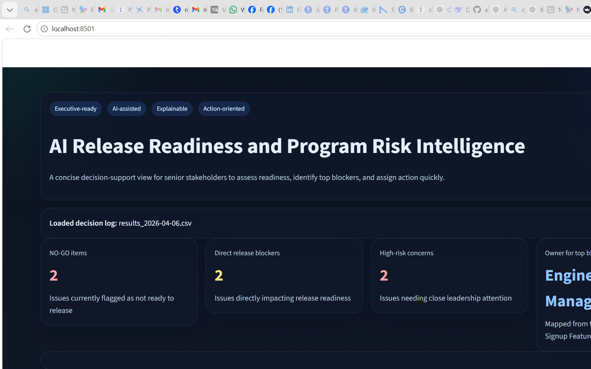

# AI Release Readiness and Program Risk Intelligence Engine

An AI-assisted decision support system for release leaders, program managers, and engineering stakeholders.

This project turns short delivery updates into structured release-readiness decisions with:

- issue title
- risk type
- risk level
- release readiness status
- blocker flag
- recommended owner
- recommended action
- evidence-backed rationale

## Why This Project

Senior stakeholders rarely need raw status text. They need fast answers to questions like:

- What is the issue?
- How serious is it?
- Does it affect release readiness?
- Who should act first?
- What should happen next?

This repo is designed to show how an LLM can convert one-line project updates into decision-ready program intelligence instead of just classifying text.

## What Changed In This Version

The project was simplified to avoid brittle, ever-growing rule logic in code.

Current design:

- one-line input goes to the LLM
- the prompt applies a stable risk taxonomy
- code only validates and normalizes the response
- the dashboard presents an executive-friendly view of the resulting decisions

This means the engine is no longer shaped around hardcoded examples like `payment`, `signup`, or `banner` bugs. Those examples are now meant for evaluation, not live branching rules.

## Core Taxonomy

The engine classifies issues into these stable risk types:

- `Product / Functional`
- `Environment / Operational`
- `Dependency / External`
- `Quality / Test`
- `Process / Governance`
- `Security / Compliance`
- `Schedule / Capacity`

## Ownership Principles

The model is instructed to choose the likely resolver, not just the coordinator:

- `Product / Functional` -> `Engineering Manager`
- `Environment / Operational` -> `Release Manager`
- `Dependency / External` -> `External Dependency Owner`
- `Quality / Test` -> `QA Lead`
- `Process / Governance` -> `Program Manager`
- `Security / Compliance` -> `Engineering Manager`
- `Schedule / Capacity` -> `Engineering Manager`

## Output Schema

Each analyzed issue produces a structured decision record with fields such as:

- `domain`
- `issue_title`
- `project_name`
- `milestone`
- `release_readiness_status`
- `blocking_flag`
- `risk_level`
- `risk_score`
- `confidence_score`
- `risk_type`
- `sub_risk_type`
- `urgency`
- `root_cause`
- `business_impact`
- `recommended_action`
- `action_owner`
- `explanation`
- `evidence_signals`
- `escalation_needed`

## System Flow

```text
Free-text update or structured JSON
        ->
LLM classification using stable taxonomy
        ->
Schema normalization and safety checks
        ->
CSV decision log
        ->
Streamlit dashboard
```

## Why This Repo Is Useful In Interviews

This project is meant to signal:

- AI-assisted decision support under uncertainty
- prompt-first system design instead of endless rule sprawl
- explainability and actionability
- stakeholder-aware dashboard design
- pragmatic use of LLMs for delivery and release leadership workflows

## Dashboard Preview

Fresh local dashboard capture:



## Run Locally

```bash
git clone https://github.com/avadhshiva/ai-risk-decision-engine.git
cd ai-risk-decision-engine
python -m venv venv
venv\Scripts\activate
pip install -r requirements.txt
```

Create a `.env` file:

```bash
OPENAI_API_KEY=your_key_here
```

Generate decisions:

```bash
python app.py
```

Launch dashboard:

```bash
streamlit run dashboard.py
```

## Example Input

Plain text:

```text
Mobile app is crashing in Android 9 version phones
```

Structured JSON:

```json
{
  "domain": "generic",
  "project_name": "Mobile App Release",
  "milestone": "Version 2.0 Launch",
  "status_summary": "Mobile app is crashing in Android 9 version phones"
}
```

## Example Output Shape

```json
{
  "domain": "generic",
  "issue_title": "Mobile App Crashing on Android 9 Devices",
  "project_name": "Mobile App Release",
  "milestone": "Version 2.0 Launch",
  "release_readiness_status": "NO_GO",
  "blocking_flag": "Yes",
  "risk_level": "HIGH",
  "risk_score": 88,
  "confidence_score": 78,
  "risk_type": "Product / Functional",
  "sub_risk_type": "App Stability",
  "urgency": "Immediate Escalation",
  "root_cause": "Crash behavior is affecting a meaningful segment of the release population.",
  "business_impact": "Release quality and user trust are at risk if the issue remains unresolved.",
  "recommended_action": "Investigate the Android 9 crash path immediately and validate a fix before release progression.",
  "action_owner": "Engineering Manager",
  "explanation": "The issue affects core application behavior and directly impacts release confidence.",
  "evidence_signals": [
    "Mobile app crash reported",
    "Android 9 devices affected"
  ],
  "escalation_needed": "Yes"
}
```

## Limitations

- output quality depends on prompt quality and model behavior
- CSV storage is a lightweight demo persistence layer
- evaluation coverage is not yet formalized into an automated benchmark
- the dashboard is optimized for demo and review, not production analytics

## Next Steps

- add `evaluation_cases.csv` for repeatable validation
- add architecture and case-study docs
- support batch ingestion of multiple updates
- refine dashboard drill-downs for issue inspection
- add source integrations like Jira or release tracker inputs

## Author

Sivakumar Avadhanam  
Senior Technical Program Manager | AI Delivery Lead
